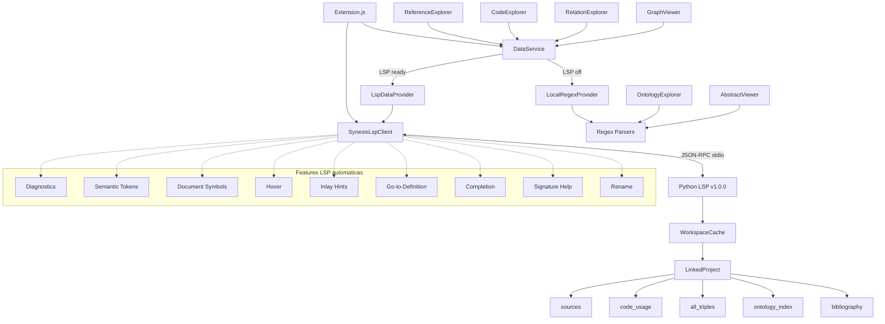

# Synesis Explorer + LSP: Estudo e Plano de Implementacao (Refinado)

Data: 2026-01-30
Atualizado: 2026-01-30 (validado contra LSP v1.0.0)

## Objetivo deste documento

Elevar o rigor tecnico das fases para que uma IA (Copilot/Cursor/ChatGPT) implemente
com menor risco de integracao, especificando contratos de dados e fluxo de estado.

## Checklist anti-alucinacao (VALIDADO)

1. ✅ O LSP server **retorna** `{ success: boolean, error?: string }` em custom requests.
2. ✅ Modulo para iniciar o LSP: `python -m synesis_lsp`.
3. ✅ LanguageId: `synesis` (definido em `package.json` da extensao `vscode-extension/`).
4. ✅ Custom requests (`synesis/*`): `location.line` e `location.column` sao **1-based**.
   Features LSP padrao (`textDocument/*`): posicoes sao **0-based** (conforme protocolo).
5. ✅ Endpoints existentes documentados abaixo com schemas **reais** do servidor v1.0.0.

## Estado atual do LSP Server (v1.0.0 - 193 testes)

### Custom Requests (JSON-RPC commands)

| Endpoint | Status | Descricao |
|----------|--------|-----------|
| `synesis/loadProject` | ✅ Existe | Compila projeto completo, retorna stats |
| `synesis/getProjectStats` | ✅ Existe | Stats do cache (sem recompilar) |
| `synesis/getReferences` | ✅ Existe | Lista de SOURCEs com itemCount, fields, location |
| `synesis/getCodes` | ✅ Existe | Lista de codigos com usageCount, ontologyDefined |
| `synesis/getRelations` | ✅ Existe | Lista de triples (from, relation, to) |
| `synesis/getRelationGraph` | ✅ Existe | Codigo Mermaid.js do grafo (com filtro por bibref) |
| `synesis/getOntologyTopics` | ❌ Nao existe | Proposto |
| `synesis/getOntologyAnnotations` | ❌ Nao existe | Proposto |
| `synesis/getBibliographyEntry` | ❌ Nao existe | Proposto |

### Features LSP padrao (textDocument/*)

| Feature | Status | Descricao |
|---------|--------|-----------|
| `textDocument/diagnostic` | ✅ | Validacao em tempo real (didOpen/didChange) |
| `textDocument/semanticTokens/full` | ✅ | Colorizacao semantica (keywords, bibrefs, campos, codigos) |
| `textDocument/documentSymbol` | ✅ | Outline: SOURCE->Class, ITEM->Method, ONTOLOGY->Struct |
| `textDocument/hover` | ✅ | @bibref->bib, campo:->template, codigo->ontologia |
| `textDocument/inlayHint` | ✅ | (Autor, Ano) inline apos cada @bibref |
| `textDocument/definition` | ✅ | @bibref->SOURCE .syn, codigo->ONTOLOGY .syno |
| `textDocument/completion` | ✅ | @bibrefs, codigos da ontologia, campos do template (trigger: @) |
| `textDocument/signatureHelp` | ✅ | Definicao do campo durante preenchimento (trigger: :) |
| `textDocument/rename` | ✅ | Renomear bibref/codigo em todos os arquivos do workspace |
| `textDocument/prepareRename` | ✅ | Verifica se simbolo e renomeavel |

## Estado atual da extensao synesis-explorer

- 100% local: usa regex parsers para `.syn`, `.syno`, `.synt`, `.synp` e `.bib`.
- 5 Explorers: Reference, Code, Relation, Ontology, OntologyAnnotation
- 2 Viewers: GraphViewer (Mermaid), AbstractViewer (BibTeX HTML)
- 5 Parsers: SynesisParser, OntologyParser, ChainParser, TemplateParser, BibtexParser
- Nao existe integracao com LSP.

## Principios de migracao

- LSP-first com fallback local (nao quebrar funcionalidades).
- Incremental por fase (cada fase agrega valor isoladamente).
- Contrato de dados explicito (schema JSON + exemplos).
- Estado assincrono previsivel (status bar + withProgress).
- Degradacao graciosa quando LSP indisponivel.

## Estrategia de dados (recomendada)

Para evitar codigo "sujo" com muitos `if (lspReady)` nos explorers, adotar um
`DataService` (Adapter Pattern) com dois providers internos:

```
DataService
  - LspDataProvider
  - LocalRegexProvider
```

O `DataService` decide a fonte com base em `lspClient.isReady()` e faz fallback
silencioso em erro (ex: `success: false`).

---

## Contrato de Dados VALIDADO (LSP v1.0.0)

### Envelope padrao

Todos os custom requests retornam:

```js
/**
 * @typedef {Object} LspResult
 * @property {boolean} success
 * @property {string=} error
 */
```

### `synesis/loadProject`

**Params:** `{ workspaceRoot?: string }` ou `[{ workspaceRoot?: string }]`

**Retorno real:**

```js
/**
 * @typedef {Object} LoadProjectStats
 * @property {number} source_count
 * @property {number} item_count
 * @property {number} ontology_count
 * @property {number} code_count
 * @property {number} chain_count
 * @property {number} triple_count
 */
/**
 * @typedef {LspResult & {
 *   stats?: LoadProjectStats,
 *   has_errors?: boolean,
 *   has_warnings?: boolean,
 *   location?: { file: string, line: number, column: number }
 * }} LoadProjectResult
 */
```

Exemplo real:

```json
{
  "success": true,
  "stats": {
    "source_count": 50,
    "item_count": 13654,
    "ontology_count": 291,
    "code_count": 281,
    "chain_count": 9827,
    "triple_count": 17820
  },
  "has_errors": false,
  "has_warnings": false
}
```

> **NOTA:** Os nomes das chaves sao `source_count`, `item_count` etc. (snake_case).
> O documento original sugeria `files`, `references`, `codes`, `relations` — esses
> nomes **nao** correspondem ao servidor real.

### `synesis/getProjectStats`

**Params:** Mesmo que loadProject.
**Retorno:** Mesmo schema de stats, sem recompilar.

### `synesis/getReferences`

**Retorno real:**

```js
/**
 * @typedef {Object} LspLocation
 * @property {string} file    // path relativo (ex: "interviews/e01.syn")
 * @property {number} line    // 1-based
 * @property {number} column  // 1-based
 */
/**
 * @typedef {Object} LspReference
 * @property {string} bibref       // com @ prefix (ex: "@entrevista01")
 * @property {number} itemCount
 * @property {Object} fields       // campos do SOURCE (ex: { codigo: "N/A" })
 * @property {LspLocation=} location
 */
/**
 * @typedef {LspResult & { references?: LspReference[] }} ReferencesResult
 */
```

Exemplo real:

```json
{
  "success": true,
  "references": [
    {
      "bibref": "@entrevista01",
      "itemCount": 245,
      "fields": { "codigo_do_respondente": "P01" },
      "location": { "file": "interviews/entrevista01.syn", "line": 1, "column": 1 }
    }
  ]
}
```

> **NOTA:** `bibref` inclui o prefixo `@`. `location.line` e `location.column` sao 1-based.

### `synesis/getCodes`

**Retorno real:**

```js
/**
 * @typedef {Object} LspCode
 * @property {string} code           // nome normalizado (ex: "proposito")
 * @property {number} usageCount     // quantos ItemNodes usam este codigo
 * @property {boolean} ontologyDefined // true se existe em ontology_index
 */
/**
 * @typedef {LspResult & { codes?: LspCode[] }} CodesResult
 */
```

### `synesis/getRelations`

**Retorno real:**

```js
/**
 * @typedef {Object} LspRelation
 * @property {string} from       // codigo origem
 * @property {string} relation   // nome da relacao
 * @property {string} to         // codigo destino
 */
/**
 * @typedef {LspResult & { relations?: LspRelation[] }} RelationsResult
 */
```

### `synesis/getRelationGraph` (NOVO - v1.0.0)

**Params:** `{ workspaceRoot?: string, bibref?: string }`

**Retorno real:**

```js
/**
 * @typedef {LspResult & { mermaidCode?: string }} RelationGraphResult
 */
```

Exemplo real:

```json
{
  "success": true,
  "mermaidCode": "graph LR\n    proposito[proposito] -->|CAUSA| chamado[chamado]"
}
```

> **NOTA:** `bibref` opcional filtra o grafo para mostrar apenas relacoes dos codigos
> usados por esse bibref. Sem `bibref`, retorna grafo completo.

## Conversao de Location (Python -> VS Code)

**Confirmado:** Custom requests usam `line` e `column` **1-based**.

```js
// Para custom requests (synesis/*):
new vscode.Location(
  vscode.Uri.file(path.join(workspaceRoot, loc.file)),
  new vscode.Position(loc.line - 1, loc.column - 1)
)
```

> **NOTA:** `location.file` e um path relativo ao workspace root. Combinar com
> `workspaceRoot` para obter path absoluto.

## Fluxo de estado (async)

- `loadProject` leva ~3-4s (medido no estudo): sempre usar `withProgress`.
- StatusBar: `$(sync) Loading`, `$(check) Ready`, `$(alert) Error`, `Disabled`.
- Atualizacao automatica:
  - O servidor ja invalida cache interno em `didSave` para `.synp`, `.synt`, `.bib`, `.syn`, `.syno`.
  - O `workspace_cache` (compilacao completa) tambem e invalidado em `didSave`.
  - Porem `loadProject` **nao e chamado automaticamente** — apenas invalida o cache.
  - O client deve chamar `loadProject` novamente apos save para recompilar.
  - Alternativa: usar `synesis/getProjectStats` para detectar cache vazio.

---

## Fases de implementacao

### Fase 1: Infra LSP + Status/Comando Load

**Objetivo**
- Introduzir cliente LSP opcional, status bar e comando `loadProject`.
- **Status: IMPLEMENTAVEL** — todos os endpoints necessarios existem.

**Resultado visivel**
- `Synesis: LSP Load Project`
- Status bar: Disabled/Loading/Ready/Error

**Prompt otimizado**
```markdown
Implemente a infraestrutura do Cliente LSP no `synesis-explorer`.

CONTEXTO:
- O servidor LSP e feito em Python (pygls 1.x) e usa stdio.
- O servidor retorna `{ success: boolean, error?: string }` em custom requests.
- O modulo para iniciar: `python -m synesis_lsp`.
- O wrapper deve residir em `src/lsp/synesisClient.js`.

REQUISITOS:
1. Dependencia: adicione `vscode-languageclient` (^9.x) ao package.json.
2. Wrapper Class: `SynesisLspClient` com `start()`, `stop()`, `isReady()`,
   `sendRequest(method, params)` e um getter para ultimo `loadProject`.
3. ServerOptions: comando `python -m synesis_lsp` (stdio),
   configuravel via `synesisExplorer.lsp.pythonPath`.
4. ClientOptions: `documentSelector: [{ language: 'synesis' }]`.
5. Comando `synesis.lsp.loadProject`:
   - chama `synesis/loadProject` com `{ workspaceRoot: workspaceFolders[0] }`
   - usa `vscode.window.withProgress` (leva ~3-4s)
   - atualiza StatusBar com `$(check) Ready (50 sources, 13654 items)` ou `$(alert) Error`
   - stats retornadas: source_count, item_count, ontology_count, code_count, chain_count, triple_count
6. Configuracao: `synesisExplorer.lsp.enabled` (default true).
7. Ativacao: iniciar LSP client em `activate()` se `lsp.enabled`.
8. Desativacao: parar LSP client em `deactivate()`.

SCHEMA REAL DO SERVIDOR (loadProject):
`{ success: true, stats: { source_count, item_count, ontology_count, code_count, chain_count, triple_count }, has_errors, has_warnings }`

Erro: `{ success: false, error: "mensagem", location?: { file, line, column } }`
```

### Fase 2: Auto-refresh do cache LSP

**Objetivo**
- Manter cache LSP atualizado automaticamente com estado previsivel.
- **Status: IMPLEMENTAVEL** — o servidor invalida cache em didSave.

**Prompt otimizado**
```markdown
Implemente auto-refresh do cache LSP.

CONTEXTO:
- O LSP server invalida o workspace_cache automaticamente em didSave.
- Porem, `synesis/loadProject` precisa ser chamado novamente para recompilar.
- `synesis/getProjectStats` retorna stats do cache ou erro se cache vazio.

REQUISITOS:
1. Acione `synesis/loadProject` em `onDidSaveTextDocument` para
   `.synp`, `.synt`, `.bib`, `.syn`, `.syno`.
2. Use throttle leve (1000ms) para evitar chamadas em cascata.
3. Atualize StatusBar para Loading/Ready/Error conforme o retorno.
4. Armazene o ultimo resultado de `loadProject` no wrapper (stats + timestamp).
5. Apos loadProject bem-sucedido, dispare evento para atualizar Explorers.
6. Comando `synesis/getProjectStats` pode ser usado para polling leve
   (verifica se cache existe sem recompilar).

NOTA:
- O servidor NAO recompila automaticamente — apenas invalida cache.
- O client e responsavel por chamar loadProject apos save.
```

### Fase 3: DataService (Adapter Pattern)

**Objetivo**
- Abstrair LSP vs Regex e evitar `if/else` espalhado.
- **Status: IMPLEMENTAVEL** — todos os endpoints de dados existem.

**Prompt otimizado**
```markdown
Implemente um DataService com Adapter Pattern.

TAREFAS:
1. Crie `src/services/dataService.js`.
2. Implemente `LspDataProvider` e `LocalRegexProvider`.
3. Interface completa (todos os endpoints existem no LSP v1.0.0):
   - `getReferences(): Promise<ReferencesResult>`
   - `getCodes(): Promise<CodesResult>`
   - `getRelations(): Promise<RelationsResult>`
   - `getRelationGraph(bibref?): Promise<RelationGraphResult>`
4. O DataService decide:
   - Se `lspClient.isReady()` e request retorna `success: true` -> LSP
   - Se `success: false` ou erro -> Fallback para Regex
5. Fallback silencioso: log warning e usa LocalRegexProvider.

SCHEMAS REAIS:
- References: `{ success, references: [{ bibref, itemCount, fields, location: { file, line, column } }] }`
- Codes: `{ success, codes: [{ code, usageCount, ontologyDefined }] }`
- Relations: `{ success, relations: [{ from, relation, to }] }`
- RelationGraph: `{ success, mermaidCode: "graph LR\n..." }`

NOTA:
- `bibref` inclui prefixo @ (ex: "@entrevista01")
- `location.file` e path relativo ao workspace root
- `location.line` e `location.column` sao 1-based
```

### Fase 4: Reference Explorer via DataService

**Status: IMPLEMENTAVEL** — `synesis/getReferences` existe e retorna todos os dados necessarios.

**Prompt otimizado**
```markdown
Atualize o `ReferenceExplorer` para consumir `dataService.getReferences()`.

SCHEMA DO SERVIDOR (VALIDADO):
`{ success: true, references: [{ bibref: "@entrevista01", itemCount: 245, fields: { codigo_do_respondente: "P01" }, location: { file: "interviews/entrevista01.syn", line: 1, column: 1 } }] }`

CONVERSAO:
- `bibref` ja vem com @ prefix — usar diretamente como label
- `location.file` e relativo ao workspace — combinar com workspaceRoot
- `location.line/column` sao 1-based — subtrair 1 para vscode.Position

TAREFAS:
1. Substituir `SynesisParser.parseSourceBlocks` por `dataService.getReferences()`.
2. Converter `location` para `vscode.Location` (path relativo + 1-based).
3. Usar `bibref` como label, `itemCount` como description.
4. Tooltip com campos `fields` (MarkdownString).
5. Manter click -> navegar (openLocation).
6. Manter filtro por texto.
```

### Fase 5: Code Explorer + Relation Explorer via DataService

**Status: IMPLEMENTAVEL** — `synesis/getCodes` e `synesis/getRelations` existem.

**Prompt otimizado**
```markdown
Atualize `CodeExplorer` e `RelationExplorer` para DataService.

SCHEMAS DO SERVIDOR (VALIDADOS):
1) Codes: `{ success: true, codes: [{ code: "proposito", usageCount: 321, ontologyDefined: true }] }`
2) Relations: `{ success: true, relations: [{ from: "proposito", relation: "CAUSA", to: "chamado" }] }`

TAREFAS:
1. Adicionar `getCodes()` e `getRelations()` ao DataService.
2. CodeExplorer:
   - Substituir regex parsing por `dataService.getCodes()`
   - Exibir `usageCount` como description
   - Icone distinto quando `!ontologyDefined`
   - Nota: LSP nao retorna positions individuais dos codigos — manter
     posicoes locais (regex) para click-to-navigate se necessario,
     ou usar `textDocument/definition` do LSP para navegacao
3. RelationExplorer:
   - Substituir chainParser por `dataService.getRelations()`
   - Agrupar por `relation`
   - Filhos no formato "from -> to"
   - Nota: LSP nao retorna positions das relacoes — manter fallback
     local para click-to-navigate se necessario
4. Se `success: false`, fallback silencioso para regex local.
```

### Fase 6: Graph Viewer via LSP

**Status: IMPLEMENTAVEL** — `synesis/getRelationGraph` existe e retorna Mermaid.js pronto.

> **NOVA FASE** — nao existia no documento original. O LSP v1.0.0 ja gera codigo
> Mermaid.js completo, eliminando a necessidade de parsear CHAIN no client.

**Prompt otimizado**
```markdown
Atualize o `GraphViewer` para usar `synesis/getRelationGraph` via DataService.

SCHEMA DO SERVIDOR (VALIDADO):
`{ success: true, mermaidCode: "graph LR\n    proposito[proposito] -->|CAUSA| chamado[chamado]" }`

Com filtro por bibref:
Params: `{ workspaceRoot: "...", bibref: "@entrevista01" }`

CONTEXTO:
- O GraphViewer atual (graphViewer.js, 593 linhas) faz:
  1. Encontra bibref sob cursor
  2. Parseia CHAIN fields de todos .syn com chainParser
  3. Gera Mermaid no client com `generateMermaidGraph()`
  4. Renderiza em webview com Mermaid.js 10

- O LSP v1.0.0 ja faz passos 1-3 no servidor.

TAREFAS:
1. Adicionar `getRelationGraph(bibref?)` ao DataService.
2. Se LSP disponivel:
   - Chamar `synesis/getRelationGraph` com `{ bibref: "@ref" }` se filtrado
   - Ou sem bibref para grafo completo
   - Usar `mermaidCode` diretamente no webview
3. Se LSP indisponivel, manter logica local atual como fallback.
4. O webview (zoom, CSS, layout) permanece inalterado.
5. Nota: o Mermaid gerado pelo LSP usa formato `nodeId[label] -->|rel| nodeId2[label2]`
   com IDs sanitizados (alfanumerico + underscore).

VANTAGEM:
- Elimina ~200 linhas de parsing (chainParser + extractRelations + generateMermaidGraph)
- Dados do compilador sao mais precisos que regex parsing
```

### Fase 7: Ontology Explorers via LSP (requer novos endpoints)

**Status: PARCIALMENTE IMPLEMENTAVEL** — endpoints especificos nao existem,
mas os dados estao disponiveis no LinkedProject.

> Para implementar completamente, seria necessario adicionar ao LSP:
> - `synesis/getOntologyTopics` (topic_index + ontology_index)
> - `synesis/getOntologyAnnotations` (code_usage + ontology fields)

**Prompt otimizado**
```markdown
Implemente Ontology via LSP (requer novos endpoints no servidor).

ESTADO ATUAL:
- `synesis/getOntologyTopics` NAO existe no LSP.
- `synesis/getOntologyAnnotations` NAO existe no LSP.
- Os dados EXISTEM no LinkedProject (topic_index, ontology_index com fields).

OPCAO A — Implementar endpoints no LSP:
1. `synesis/getOntologyTopics`:
   - Retorno: `{ success, topics: [{ topic, codes: [string], fieldType: "TOPIC"|"ORDERED"|"ENUMERATED" }] }`
   - Fonte: `linked_project.topic_index` + `template.field_specs`
2. `synesis/getOntologyAnnotations`:
   - Retorno: `{ success, annotations: [{ concept, fields: {...}, location, usageCount }] }`
   - Fonte: `linked_project.ontology_index` + `linked_project.code_usage`

OPCAO B — Manter regex local com fallback:
- OntologyExplorer e OntologyAnnotationExplorer continuam usando
  OntologyParser + TemplateManager locais.
- Sem degradacao de funcionalidade.

RECOMENDACAO: Implementar Opcao A no LSP e depois migrar explorers.
```

### Fase 8: Abstract Viewer via LSP (requer novo endpoint)

**Status: PARCIALMENTE IMPLEMENTAVEL** — endpoint especifico nao existe,
mas `bibliography` esta disponivel via CompilationResult.

**Prompt otimizado**
```markdown
Implemente Abstract Viewer via LSP.

ESTADO ATUAL:
- `synesis/getBibliographyEntry` NAO existe no LSP.
- `bibliography` (Dict[str, BibEntry]) EXISTE no CompilationResult em cache.
- O hover do LSP ja mostra titulo/autor/ano/tipo para @bibrefs.

OPCAO A — Implementar endpoint no LSP:
1. `synesis/getBibliographyEntry`:
   - Params: `{ bibref: "entrevista01" }`
   - Retorno: `{ success, entry: { bibref, entryTags: { title, author, year, abstract, ... } } }`
   - Fonte: `compilation_result.bibliography[bibref]`

OPCAO B — Manter BibtexParser local:
- AbstractViewer continua lendo .bib diretamente.
- Sem degradacao de funcionalidade.

RECOMENDACAO: Implementar Opcao A no LSP (simples — dados ja estao em cache).
```

---

## Fases BONUS: Features LSP que o Explorer pode aproveitar

> As features abaixo ja existem no LSP v1.0.0 e podem ser aproveitadas
> pela extensao synesis-explorer sem necessidade de novos endpoints.
> Sao features nativas do protocolo LSP que o `vscode-languageclient`
> ativa automaticamente ao conectar.

### Fase B1: Features LSP automaticas (zero-code no Explorer)

**Status: IMPLEMENTAVEL IMEDIATAMENTE** — basta conectar o LSP client.

Ao conectar o `vscode-languageclient` na Fase 1, as seguintes features
passam a funcionar **automaticamente** sem codigo adicional no Explorer:

| Feature | O que faz | Antes (sem LSP) |
|---------|-----------|-----------------|
| Diagnostics | Squiggles vermelhos/amarelos para erros de sintaxe | Nada |
| Semantic Tokens | Colorizacao por tipo (keyword, bibref, campo, codigo) | TextMate grammar basico |
| Document Symbols | Outline view com SOURCE->ITEM->ONTOLOGY | Nada |
| Hover | Info contextual para @bibref, campo:, codigo | Nada |
| Inlay Hints | (Autor, Ano) inline apos @bibref | Nada |
| Go-to-Definition | Ctrl+Click em @bibref vai para .syn, codigo vai para .syno | Nada |
| Autocomplete | @bibrefs, codigos da ontologia, campos do template | Nada |
| Signature Help | Tipo/escopo/descricao ao preencher campo: | Nada |
| Rename | F2 em @bibref/codigo renomeia em todos os arquivos | Nada |

**Prompt:**
```markdown
Nenhuma implementacao adicional necessaria para essas features.
Elas sao ativadas automaticamente pelo protocolo LSP quando o
vscode-languageclient conecta ao servidor.

Apenas confirmar que:
1. `documentSelector` inclui todos os languageIds: `[{ language: 'synesis' }]`
2. O servidor anuncia capabilities corretamente (ja faz via pygls)
3. A extensao vscode-extension/ existente nao conflita com synesis-explorer
   (podem coexistir se usarem o mesmo languageId)
```

### Fase B2: Navegacao via LSP no Code Explorer

**Status: IMPLEMENTAVEL** — `textDocument/definition` resolve codigos.

```markdown
O CodeExplorer atual usa positionUtils para calcular posicao exata de
codigos no texto. Com o LSP, podemos usar `textDocument/definition`
para navegar diretamente para a definicao na ontologia.

TAREFAS:
1. Ao clicar em um codigo no CodeExplorer, usar
   `vscode.commands.executeCommand('vscode.executeDefinitionProvider', uri, position)`
   para navegar para a definicao no .syno.
2. Alternativa: manter navegacao para o uso no .syn (comportamento atual)
   e adicionar menu de contexto "Ir para Definicao na Ontologia".
```

### Fase B3: Rename via Explorer context menu

**Status: IMPLEMENTAVEL** — `textDocument/rename` funciona cross-file.

```markdown
Adicionar opcao "Renomear" no menu de contexto dos Explorers.

TAREFAS:
1. CodeExplorer: clique direito em codigo -> "Renomear Codigo"
   - Pede novo nome via inputBox
   - Usa `vscode.workspace.applyEdit` com o WorkspaceEdit do LSP rename
   - Ou: abre o arquivo na posicao e invoca rename via LSP diretamente
2. ReferenceExplorer: clique direito em @bibref -> "Renomear Referencia"
   - Similar ao acima

NOTA: O LSP rename atualiza todos os arquivos .syn e .syno do workspace.
```

---

## Mapa de Cobertura: Explorer Features vs LSP

| Feature do Explorer | Parser Local | Endpoint LSP | Status |
|---------------------|-------------|--------------|--------|
| ReferenceExplorer.refresh | SynesisParser.parseSourceBlocks | `synesis/getReferences` | ✅ Substituivel |
| CodeExplorer.refresh | SynesisParser.parseItems + extractCodes | `synesis/getCodes` | ✅ Substituivel (sem positions) |
| RelationExplorer.refresh | parseItems + chainParser | `synesis/getRelations` | ✅ Substituivel (sem positions) |
| GraphViewer.showGraph | chainParser + generateMermaid | `synesis/getRelationGraph` | ✅ Substituivel (Mermaid pronto) |
| OntologyExplorer.refresh | OntologyParser + TemplateManager | — | ❌ Requer novo endpoint |
| OntologyAnnotationExplorer.refresh | OntologyParser + active doc | — | ❌ Requer novo endpoint |
| AbstractViewer.showAbstract | BibtexParser + fuzzyMatcher | — | ❌ Requer novo endpoint |
| Click-to-navigate (positions) | positionUtils | `textDocument/definition` | ✅ Via LSP protocol |
| Diagnostics/Validation | — | `textDocument/diagnostic` | ✅ Automatico |
| Syntax Highlighting | TextMate | `textDocument/semanticTokens` | ✅ Automatico |
| Outline | — | `textDocument/documentSymbol` | ✅ Automatico |
| Hover info | — | `textDocument/hover` | ✅ Automatico |
| Inline author/year | — | `textDocument/inlayHint` | ✅ Automatico |
| Go-to-definition | — | `textDocument/definition` | ✅ Automatico |
| Autocomplete | — | `textDocument/completion` | ✅ Automatico |
| Signature help | — | `textDocument/signatureHelp` | ✅ Automatico |
| Rename symbol | — | `textDocument/rename` | ✅ Automatico |

## Diagrama de Arquitetura (atualizado)



## Resumo de prioridade

| Fase | Dependencia | Esforco | Valor |
|------|------------|---------|-------|
| 1. Infra LSP | — | Medio | Alto (habilita tudo) |
| B1. Features automaticas | Fase 1 | Zero | Muito alto (9 features gratis) |
| 2. Auto-refresh | Fase 1 | Baixo | Alto |
| 3. DataService | Fase 1 | Medio | Alto (fundacao) |
| 4. ReferenceExplorer | Fase 3 | Baixo | Alto |
| 5. Code+Relation Explorer | Fase 3 | Medio | Alto |
| 6. GraphViewer via LSP | Fase 3 | Baixo | Medio |
| B2. Navegacao via definition | Fase 1 | Baixo | Medio |
| B3. Rename via context menu | Fase 1 | Baixo | Medio |
| 7. Ontology (novos endpoints) | Fase 3 + LSP | Alto | Medio |
| 8. Abstract (novo endpoint) | Fase 3 + LSP | Medio | Baixo |

## Observacoes finais

- Fase 1 e pre-requisito para TUDO. Implementar primeiro.
- Fase B1 e **gratis** — ao conectar o LSP, 9 features aparecem sem codigo.
- Fases 4, 5, 6 sao as de maior ROI (substituem parsers locais por dados do compilador).
- Fases 7 e 8 requerem novos endpoints no LSP — implementar no servidor primeiro.
- O LSP e a fonte de verdade quando disponivel.
- Sempre usar `success: false` como trigger de fallback para regex local.
